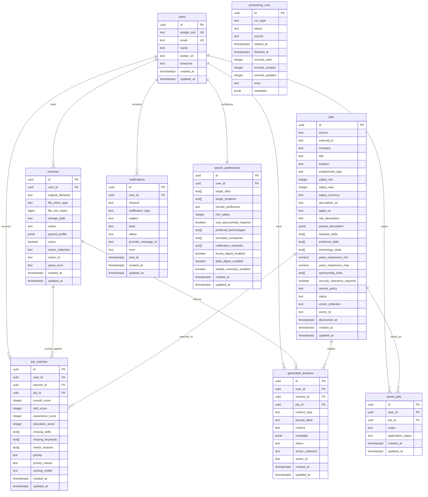

# ER Diagram

## Vector Relationships

ChromaDB stores vectors outside PostgreSQL. PostgreSQL records keep `vector_collection` and `vector_id` references for:

- `resumes`
- `jobs`
- `generated_answers`

This keeps transactional metadata in PostgreSQL while allowing semantic search to evolve independently.
